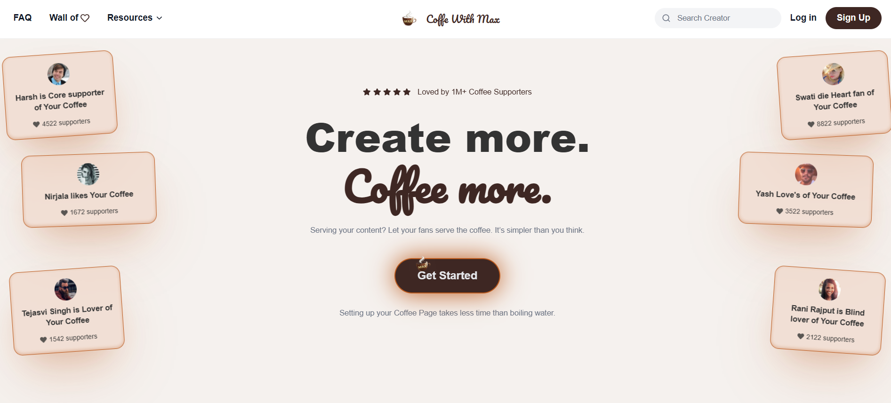

# ☕ Coffee With Max
**Coffee With Max** is a frontend React project created as a learning and portfolio project.  
It focuses on reusable components, clean folder structure, and proper React Router usage.

---
# 🚀 Project Overview

# 🌐 [Visit My Website](https://coffeewithmax.netlify.app/)

---

## 🛠️ Tech Stack
A modern **React + Vite** web application built to practice and demonstrate real-world React concepts such as component-based architecture, routing, and state management.
- React JS
- Vite
- React Router DOM
- CSS / Tailwind CSS

---

## 📂 Project Structure

CoffeeWithMax/
├── public/
├── src/
│   ├── assets/
│   ├── Components/
│   │   ├── Navbar.jsx
│   │   ├── Hero.jsx
│   │   ├── HowItWorks.jsx
│   │   ├── Features.jsx
│   │   ├── Testimonials.jsx
│   │   ├── Publish.jsx
│   │   ├── CallToAction.jsx
│   │   └── Footer.jsx
│   ├── Pages/
│   │   ├── Home.jsx
│   │   ├── Login.jsx
│   │   └── Signup.jsx
│   ├── App.jsx
│   ├── main.jsx
│   └── index.css
├── package.json
├── vite.config.js
└── README.md

---

## ✨ Features

- Component-based architecture
- Client-side routing with React Router
- Clean and scalable project structure
- Modern development with Vite

---

## ▶️ Getting Started

### Clone the repository
git clone https://github.com/your-username/coffee-with-max.git

### Go to project folder
cd CoffeeWithMax

### Install dependencies
npm install

### Run development server
npm run dev

Open in browser:
http://localhost:5173

---

## 🧠 Learning Outcomes

- Understanding React components
- Default export vs named export
- React Router setup
- Debugging common React errors
- Project structuring best practices

---

## 📌 Future Enhancements

- Authentication system
- Better UI/UX
- Responsive design
- API integration

---

## 📄 License

This project is licensed under the MIT License.

---

## 👤 Author

Harsh Rajput  
React Developer (Learner)
